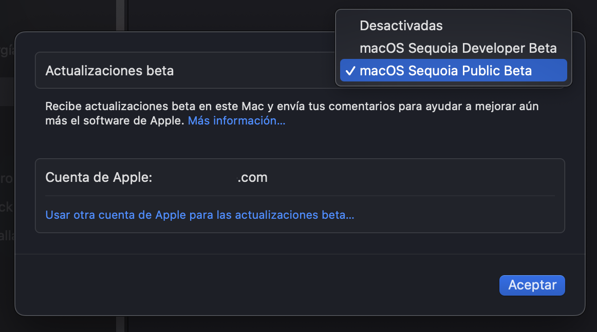

### Get macOS 15 Sequoia beta

Since the release of macOS 15 Public Beta it is easy to participate in the testing program. If you have macOS Ventura 13.4 or later:

- Go to the [Free Apple Beta Software Program](https://beta.apple.com/) site
- Sign in with your Apple account -> Get Started -> Enroll your Mac
- Go to Software Update -> Beta Updates
- Open the drop-down menu and choose macOS Sequoia Public Beta
- Download the package
- macOS 15 Beta Installer app is saved in the Applications folder.

Note: Apple account on your Mac must match the one in the beta program.

This is the easiest way to get macOS 15.

There is another way which is to download the full installation package, it is not necessary to access the Apple beta program. There are free applications that are well known and tested enough to download macOS 15 Beta Installer, these are just 2 of them:

- [GibMacOS](https://github.com/corpnewt/gibMacOS) (Terminal application)
- [Mist](https://github.com/ninxsoft/Mist) (graphical application that can also create the installation USB device).

From here you can update the current system or create an installation USB device to install Sequoia from scratch. This task is sufficiently described on the Internet, here is a simple reminder:

- Get a USB device with at least 16 GB (preferably 32)
- Prepare the device with Disk Utility:
- Name: USB
- Partition scheme: GUID
- Format: MacOS Extended Journaled
- Open Terminal and run `sudo /Applications/Install\ macOS\ Sequoia\ Beta.app/Contents/Resources/createinstallmedia --volume /Volumes/USB /Applications/Install\ macOS\ Sequoia\ Beta.app --nointeraction`
- When finished, the USB device is named Install macOS Sequoia Beta
- Prepare OpenCore on the EFI partition of the USB device.
- You can now boot from this device and install macOS from scratch.
